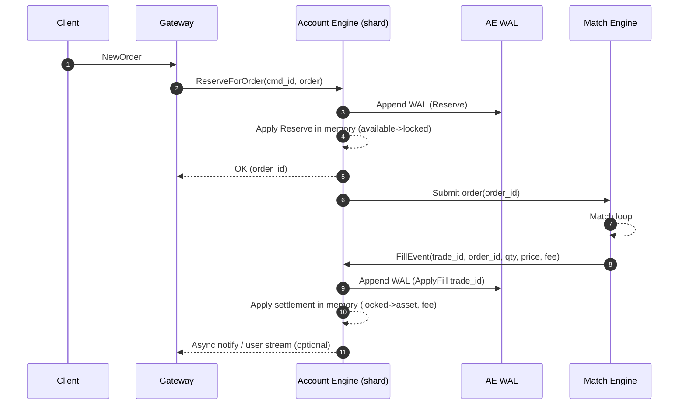
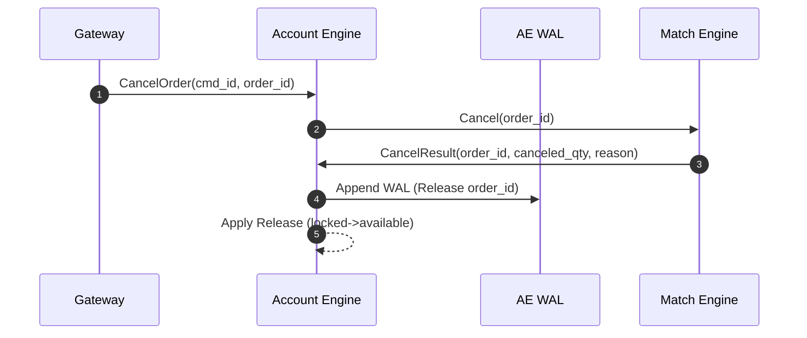
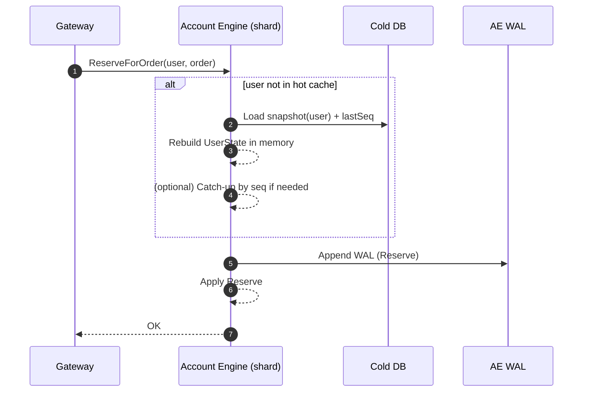
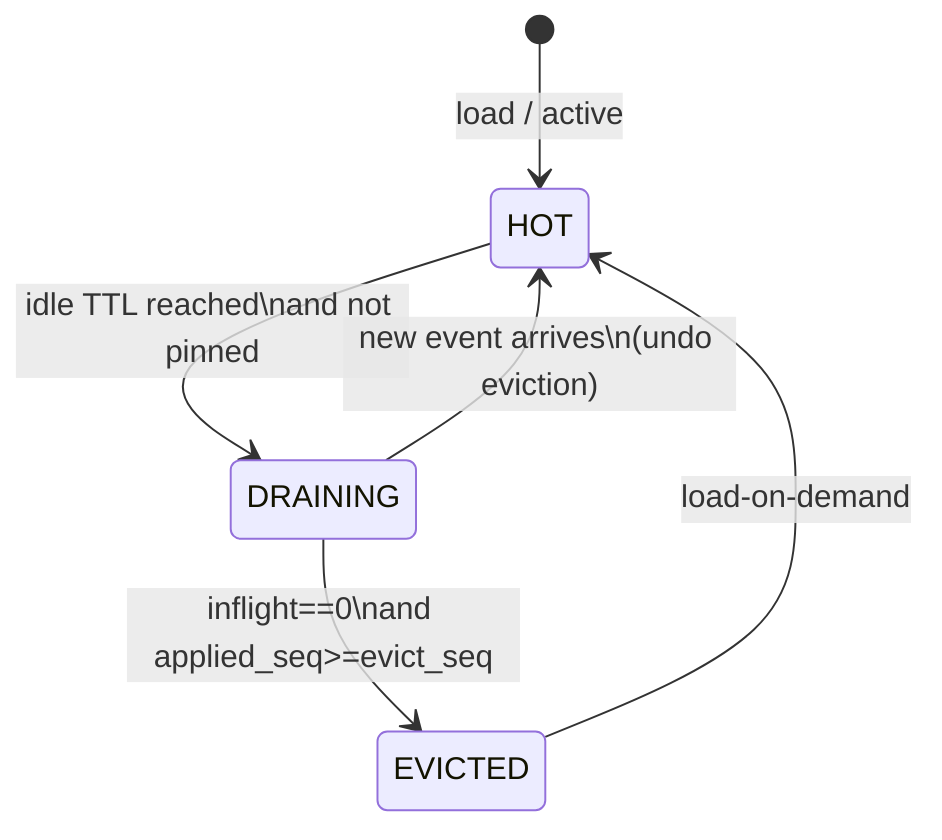
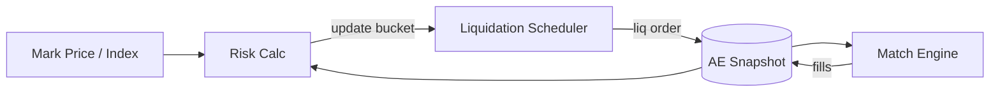
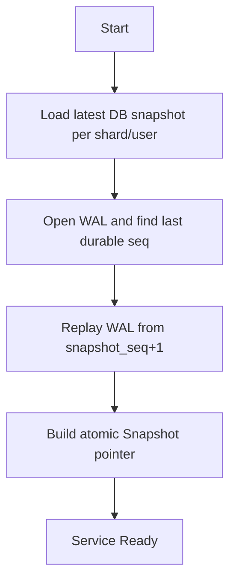
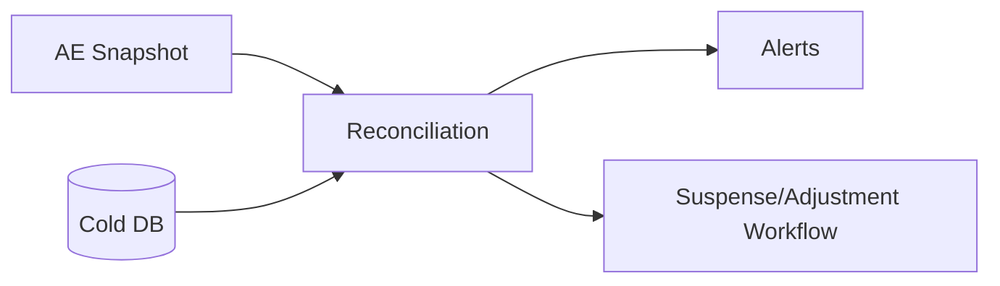

# 资金系统（热内存影子账户 + 冷DB账本）架构与流程图

> 目标：撮合/风控/下单热路径 **零 DB/Redis 查询**（纯内存 O(1)），同时保证资金状态 **可恢复、可审计、可对账**。  
> 定义：**热数据 = 内存影子账户（Hot Shadow Ledger）**；**冷数据 = DB 账本/快照（Cold Ledger）**。

---

## 1. 核心原则

1. **热账为实时交易真相**：下单校验、冻结、成交结算、强平占用/释放都在热账完成。
2. **WAL 先行（强一致）**：任何会改变余额/仓位的命令必须先 `Append WAL -> (可选 group fsync) -> Apply 内存`，再异步落 DB。
3. **冷账最终一致**：DB 用于查询/审计/报表/对账/快照，**不参与热路径同步读取**。
4. **事件至少一次 + 幂等**：撮合事件（Fill/Cancel/Reject）投递给资金引擎至少一次，资金引擎按 `cmd_id/trade_id` 幂等应用。
5. **按用户冷热**：用户是否常驻热端由 `挂单/持仓/借贷/近期活跃` 决定；冷用户首次交易允许一次 DB Load（一次慢，后面快）。

---

## 2. 模块划分

- **Order API / Gateway**
  - 接收下单/撤单请求
  - 路由到对应资金分片
  - 回传“是否接受订单”（以资金冻结成功为准）

- **Account Engine（AE）资金引擎**
  - 分片（按 `user_id` 一致性哈希），每个 shard 单线程 apply（避免锁）
  - 维护 `UserState`（available/locked/positions/risk metrics…）
  - 提供 `atomic Snapshot` 给风控/强平无锁读
  - 接口：`ReserveForOrder / Release / ApplyFill / ApplyFunding / ApplyLiq / GetSnapshot`

- **Match Engine（ME）撮合引擎**
  - 你现有 `pkg/mtrade`（按 symbol 单线程撮合）
  - 只关心订单簿，不查余额
  - 产生 Fill/Cancel 等事件

- **Risk / Liquidation**
  - 读 AE 快照（+行情）计算风险率/触发强平
  - 强平单仍走正常下单通道（避免绕过资金一致性）

- **WAL（本地顺序日志）**
  - AE WAL：记录所有资金命令（Reserve/Release/ApplyFill…）
  - ME WAL：记录订单输入/撮合结果（可选）
  - WAL 是恢复真相（DB 慢/挂也不影响短期运行）

- **DB Writer（异步）**
  - 消费 WAL/事件批量落 DB（journal/posting + snapshot）

- **Reconciliation（对账）**
  - 周期性比对热快照 vs 冷账聚合/快照
  - 差异进入 Suspense/告警/审计流程

---

## 3. 高层架构图（组件与数据流）

```mermaid
flowchart LR
  subgraph Client
    U[User/Client]
  end

  subgraph API
    GW[Order API / Gateway]
  end

  subgraph Core["In-Process Core (low-latency)"]
    AE[Account Engine (sharded, single-writer)]
    ME[Match Engine (per symbol, single-thread)]
    RISK[Risk Engine]
    LIQ[Liquidation Engine]
  end

  subgraph Storage
    AEWAL[(AE WAL files)]
    MEWAL[(ME WAL files)]
    DB[(Cold DB: journal/posting/snapshots)]
  end

  subgraph Async
    WR[DB Writer / Replicator]
    REC[Reconciliation + Alerts]
  end

  U --> GW
  GW -->|Reserve/Cancel| AE
  AE -->|OrderAccepted| GW
  AE -->|Send order| ME
  ME -->|Fill/Cancel events| AE
  RISK -->|read snapshot| AE
  LIQ -->|read snapshot| AE
  LIQ -->|liq orders| AE

  AE --> AEWAL
  ME --> MEWAL
  AEWAL --> WR
  MEWAL --> WR
  WR --> DB
  REC --> DB
  REC -->|compare| AE
```

---

## 4. 热端关键数据结构（UserState）

> **按用户冷热**：热端只保存「挂单/持仓/借贷/近期活跃」用户。冷用户在首次交易时加载。

- Spot：
  - `available[asset]`
  - `locked[asset]`（挂单冻结、提现冻结、保证金占用建议拆子类）
  - `openSpotOrderCount`

- Perp：
  - `position[symbol]`（size/entry/uPnL/IM/MM…）
  - `openPerpOrderCount`
  - `riskMetrics`（可选：equity、marginReq、riskRatio…用于风控快速判断）

- 元信息：
  - `lastActiveAt`
  - `lastSeq`（热端已应用到的全局序列）
  - `pinnedReason`（持仓/挂单/借贷/冻结/活跃…）

---

## 5. 下单/撤单/成交结算流程（强一致热路径）

### 5.1 下单（Reserve -> Send -> Fill）时序图



**关键保证**
- 只有 `Reserve` 成功才把订单送入撮合（资金冻结是“门闸”）。
- Fill 事件 **至少一次投递**，AE 按 `trade_id` 幂等应用。
- 热路径不读 DB；WAL 是恢复依据。

### 5.2 撤单（Release）



---

## 6. 冷用户首次交易：Load-on-demand（一次 DB 读）

### 6.1 Load 流程



### 6.2 Evict（踢回冷端）必须两段式（避免竞态）



**Pinned（不可 evict）条件**
- `openOrderCount > 0`
- `hasPerpPosition == true`
- `hasDebt/interest == true`
- `locked != 0`（任何冻结/在途）

---

## 7. 永续/风控/强平与资金引擎的耦合点

### 7.1 风控读取路径（全无锁）
- 风控线程读取：`AE.GetSnapshot()`（atomic pointer）
- 行情更新：驱动 `riskMetrics` 更新或触发风险分桶调整（RiskLevelIndex）
- 强平下单：仍走 `ReserveForOrder`（或专用 liq-reserve），避免绕过资金一致性



---

## 8. WAL / DB 持久化与恢复

### 8.1 WAL 建议字段
- `seq`：全局单调递增（或每 shard 递增 + 全局合并）
- `cmd_id`：幂等键（Reserve/Release/Transfer…）
- `trade_id`：成交幂等键（Fill）
- `crc`：校验
- `ts`：可选

### 8.2 启动恢复流程



### 8.3 DB 写入（最终一致）
- DBWriter 批量写入：
  - `ledger_journal(seq, cmd_id, type, meta...)`
  - `ledger_posting(seq, account, asset, delta...)`
  - `balance_snapshot(user_id, state_blob, last_seq)`（周期性）

---

## 9. 对账（Reconciliation）与差异处理（Suspense）



- 差异超过阈值：告警 + 进入 Suspense 调整凭证流程
- 任何修正都必须形成 journal（带原因/审批/追踪号），禁止直接改余额

---

## 10. 回压、熔断与降级（行情风暴必须有）

- **回压**：AE cmd queue 满 → 拒单/限流；ME event queue 满 → Fill 优先
- **熔断**：暂停开仓/只允许减仓；必要时暂停出金；提高保证金/提速强平
- **降级**：风险扫描降频只扫高风险桶；WAL group fsync 增大 batch

---

## 11. 最小 DB Schema（示意）

- `ledger_journal`
  - `seq bigint primary key`
  - `cmd_id text unique`
  - `type smallint`
  - `ts timestamptz`
  - `meta jsonb`

- `ledger_posting`
  - `id bigserial primary key`
  - `seq bigint index`
  - `account text`
  - `asset text`
  - `delta numeric/int64`

- `balance_snapshot`
  - `user_id bigint`
  - `blob bytea/jsonb`
  - `last_seq bigint`
  - `updated_at`

---

## 12. 实施路径（按阶段落地）

1. AE 单线程分片 + WAL + Snapshot（先把热账做对）
2. 接入撮合：Reserve -> ME -> Fill -> ApplyFill
3. DBWriter：WAL 异步落库 + 周期快照
4. Load-on-demand + Evict 状态机（工作集缓存）
5. 风控/强平：读快照 + 风险分桶索引
6. 对账与告警：热 vs 冷差异检测 + Suspense 调整凭证
