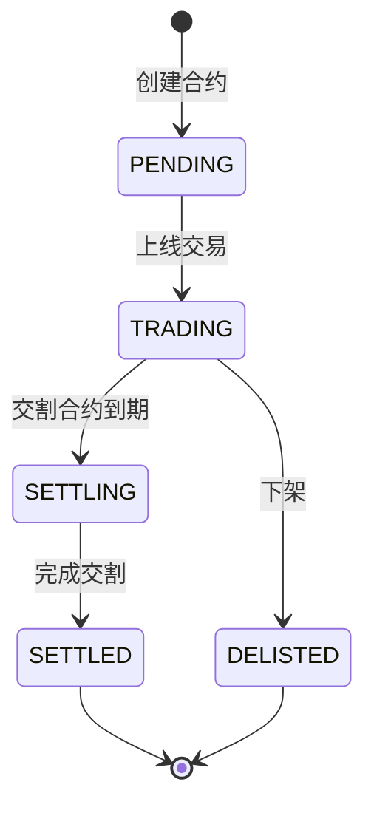
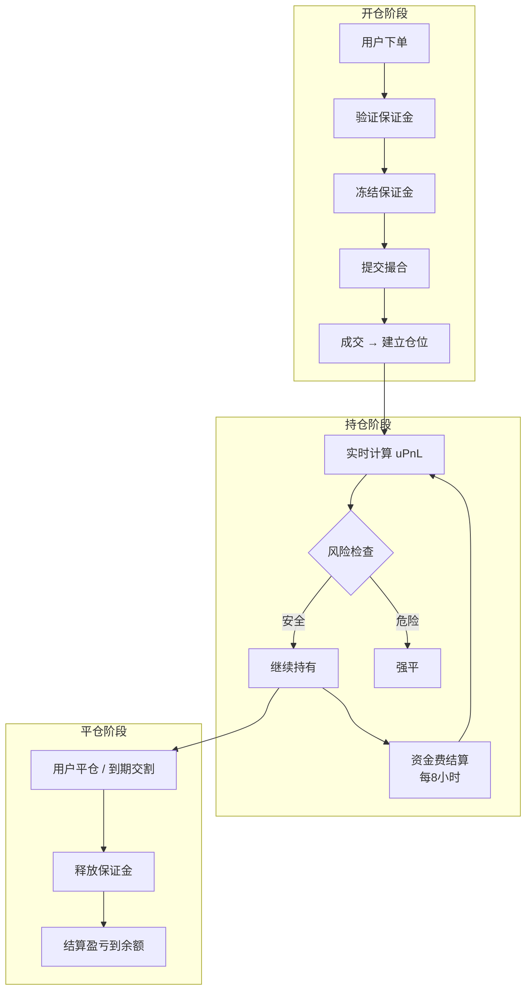

# 合约交易系统设计文档

> 从基础概念到完整实现的学习路径

---

## 1. 什么是合约？

### 1.1 基本定义

**合约 (Futures Contract)** 是一种标准化的金融衍生品，买卖双方约定在**未来某个时间**以**约定价格**交割某种资产。

```
现货交易: 我有 1 BTC，卖给你，你给我 50000 USDT，立即交割
合约交易: 我们约定 3 个月后，你用 50000 USDT 买我 1 BTC（不管到时候价格多少）
```

### 1.2 合约 vs 现货

| 维度 | 现货 (Spot) | 合约 (Futures) |
|------|------------|----------------|
| 交割时间 | 立即 | 未来约定日期 / 永续 |
| 杠杆 | 无 (1x) | 1x ~ 125x |
| 做空 | 需要借币 | 直接开空 |
| 资金要求 | 全额 | 保证金 (部分) |
| 风险 | 最多亏完本金 | 可能爆仓 |

### 1.3 为什么需要合约？

1. **套期保值 (Hedging)** - 矿工锁定未来卖出价格，规避价格下跌风险
2. **杠杆交易** - 用小资金撬动大仓位，放大收益（也放大亏损）
3. **双向交易** - 可以做多（看涨）也可以做空（看跌）
4. **价格发现** - 反映市场对未来价格的预期

---

## 2. 合约类型

### 2.1 交割合约 (Delivery Futures)

有明确到期日，到期时按结算价交割。

```
BTC-20260315  (2026年3月15日到期)
BTC-20260630  (2026年6月30日到期)
```

**特点**:
- 到期自动结算
- 价格会向现货收敛
- 临近交割波动较大

### 2.2 永续合约 (Perpetual Futures)

没有到期日，可以永久持有，通过**资金费率**机制锚定现货价格。

```
BTC-PERP  (永续，无到期日)
ETH-PERP
```

**特点**:
- 无需考虑交割
- 资金费率每 8 小时结算
- 最受欢迎的合约类型

### 2.3 合约规格 (Contract Specification)

每个合约上线前必须定义**合约规格**，这是交易的基础参数：

| 参数 | 示例 (SOL-PERP) | 说明 |
|------|-----------------|------|
| **Symbol** | SOLUSDT | 合约标识 |
| **结算币种** | USDT | 盈亏以什么币种结算 |
| **合约面值** | 1 SOL | 每张合约代表多少标的资产 |
| **最小价格单位** | 0.01 | Tick Size，最小价格变动 |
| **最大杠杆** | 100x | 用户可选的最大杠杆倍数 |
| **初始保证金率** | 1% | 1/杠杆，100x → 1% |
| **维持保证金率** | 0.5% | 低于此比例触发强平 |
| **资金费率上限** | ±0.75% | 单次资金费率限制 |
| **价格来源** | Binance, OKX... | 指数价格的数据源 |
| **最小下单量** | 0.1 SOL | 最小交易数量 |
| **最大仓位** | 100,000 SOL | 单用户最大持仓 |

#### 合约规格数据结构

```go
// ContractSpec 合约规格
type ContractSpec struct {
    Symbol          string   // 合约标识 "SOLUSDT"
    BaseCurrency    string   // 标的资产 "SOL"
    QuoteCurrency   string   // 报价货币 "USDT"
    SettleCurrency  string   // 结算货币 "USDT"
    
    ContractSize    int64    // 合约面值 (精度单位)
    TickSize        int64    // 最小价格变动 (精度单位)
    MinOrderQty     int64    // 最小下单量
    MaxOrderQty     int64    // 最大下单量
    MaxPositionQty  int64    // 最大持仓量
    
    MaxLeverage     int      // 最大杠杆 (100 = 100x)
    InitialMarginRate  int64 // 初始保证金率 (万分比, 100 = 1%)
    MaintMarginRate    int64 // 维持保证金率 (万分比, 50 = 0.5%)
    
    FundingInterval int64    // 资金费结算间隔 (秒, 28800 = 8h)
    MaxFundingRate  int64    // 资金费率上限 (万分比)
    
    PriceSources    []string // 指数价格来源 ["binance", "okx"]
    
    Status          string   // TRADING / SETTLING / DELISTED
    ListedAt        int64    // 上线时间
    ExpiryAt        int64    // 到期时间 (永续为0)
}
```

#### 合约生命周期



---

## 3. 核心概念

### 3.1 保证金 (Margin)

开仓需要押入的资金，不是全额，而是仓位价值的一部分。

```
仓位价值: 1 BTC × $50000 = $50000
杠杆倍数: 10x
所需保证金: $50000 / 10 = $5000
```

| 类型 | 说明 |
|------|------|
| 初始保证金 (IM) | 开仓所需的最低保证金 |
| 维持保证金 (MM) | 维持仓位所需的最低保证金，低于则强平 |

### 3.2 未实现盈亏 (uPnL)

持仓还未平仓时的浮动盈亏。

```go
// 多头
uPnL = (标记价格 - 开仓均价) × 持仓数量

// 空头
uPnL = (开仓均价 - 标记价格) × 持仓数量
```

### 3.3 保证金率与强平

```go
保证金率 = (账户权益) / (维持保证金)
账户权益 = 可用余额 + 未实现盈亏

当保证金率 < 100% 时，触发强平
```

### 3.4 资金费率 (Funding Rate)

永续合约特有，每 8 小时多空双方互相支付，使合约价格锚定现货。

```
合约价格 > 现货价格 → 多头付给空头（抑制多头）
合约价格 < 现货价格 → 空头付给多头（抑制空头）

资金费 = 持仓价值 × 资金费率
```

---

## 4. 合约交易完整流程



### 4.1 开仓流程

```
1. 用户下单 (方向、数量、杠杆)
2. 计算所需保证金 = 仓位价值 / 杠杆
3. 检查账户余额 ≥ 保证金
4. 冻结保证金
5. 提交到撮合引擎
6. 成交后建立 Position 记录
```

### 4.2 持仓期间

```
1. 实时更新标记价格
2. 计算未实现盈亏
3. 检查保证金率，必要时强平
4. 每 8 小时收取/支付资金费
```

### 4.3 平仓流程

```
1. 用户提交平仓单（反向单）
2. 撮合成交
3. 计算已实现盈亏
4. 释放占用保证金
5. 盈亏结算到账户余额
```

---

## 5. 为什么期权和合约放在一起？

### 共同点

| 特性 | 合约 | 期权 |
|------|------|------|
| 衍生品 | ✅ | ✅ |
| 需要保证金 | ✅ | ✅ (卖方) |
| 有杠杆效应 | ✅ | ✅ |
| 需要风控 | ✅ | ✅ |
| 可做多做空 | ✅ | ✅ |

### 架构复用

```
共享组件:
├── AccountEngine (资产/保证金管理)
├── RiskEngine (风险计算)
├── LiquidationEngine (强平引擎)  
├── MatchEngine (撮合引擎)
└── MarkPriceService (标记价格)

差异部分:
├── 合约: 简单线性盈亏
└── 期权: Greeks 计算、非线性盈亏
```

### 组合保证金

期权 + 合约放一起可以实现**组合保证金 (Portfolio Margin)**：

```
例: 持有 BTC 多头合约 + BTC Put 期权
    → 风险对冲，保证金可以降低
```

---

## 6. 开发计划

### Phase 1: 永续合约核心
- [ ] 合约订单簿 (复用 mtrade)
- [ ] Position 数据结构
- [ ] 保证金计算
- [ ] 开仓/平仓流程

### Phase 2: 风控与强平
- [ ] 标记价格服务
- [ ] 实时 uPnL 计算
- [ ] 保证金率监控
- [ ] 强平执行对接

### Phase 3: 资金费率
- [ ] 资金费率计算
- [ ] 定时结算任务
- [ ] 费用收取/支付

### Phase 4: 交割合约
- [ ] 到期日管理
- [ ] 自动交割结算
- [ ] 合约创建/下架

---

## 7. 关键数据结构预览

```go
// Position 合约持仓
type Position struct {
    UserID     int64   // 用户ID
    Symbol     string  // 合约标识 "BTC-PERP"
    Side       Side    // LONG / SHORT
    Size       int64   // 持仓数量
    EntryPrice int64   // 开仓均价
    Margin     int64   // 占用保证金
    Leverage   int     // 杠杆倍数
    UpdatedAt  int64
}

// FundingPayment 资金费记录
type FundingPayment struct {
    UserID    int64
    Symbol    string
    Amount    int64  // 正=收到，负=支付
    Rate      int64  // 费率 (万分比)
    Timestamp int64
}
```

---

## 8. 面试考点

1. 永续合约如何锚定现货价格？
2. 资金费率的计算公式和作用？
3. 为什么用标记价格而不是最新成交价计算强平？
4. 逐仓和全仓模式的区别？
5. 合约交割流程是怎样的？
